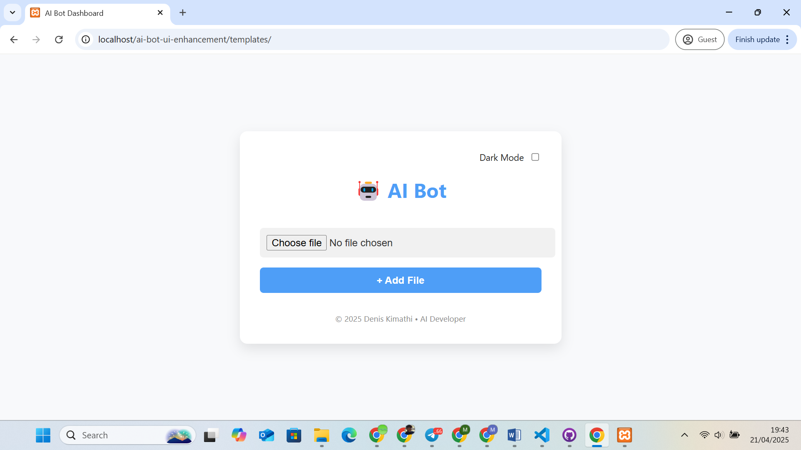

# 🤖 AI Bot UI Enhancement

A simple, responsive Flask web interface for an AI bot that includes:

- Dark/Light mode toggle
- File upload form with "+ Add File" button
- Clean card-based modern layout
- Easily extendable with admin and login modules

---

## 📸 Screenshot



> Upload a screenshot named `screenshot.png` in your repository for this preview.

---

## ✨ Features

- ✅ Toggle between dark and light mode
- ✅ Responsive design (desktop + mobile)
- ✅ Styled file upload with modern buttons
- ✅ Organized layout using cards and flexbox
- ✅ Built-in styling with no external CSS required

---

## 🛠️ Tech Stack

- HTML5  
- CSS3 (embedded, responsive, card-based)  
- Flask (Python backend for file upload handling)  

---

## 🚀 Setup Instructions

1. **Clone this repo:**
```bash
git clone https://github.com/Denis-kimathi/ai-bot-ui-enhancement.git
cd ai-bot-ui-enhancement
